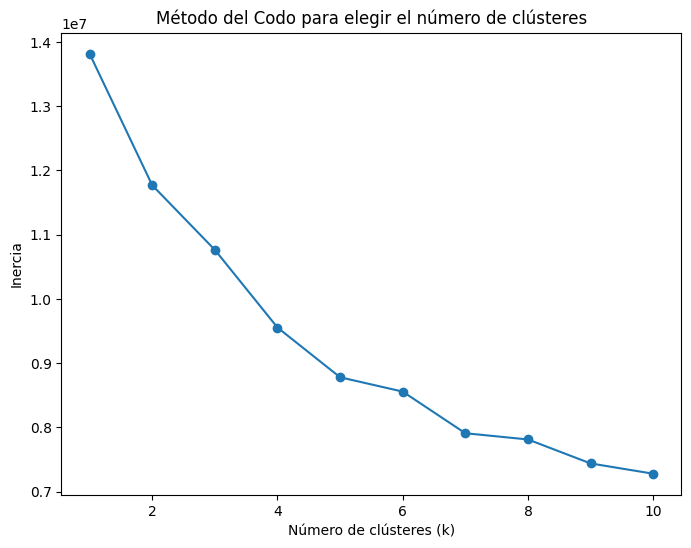
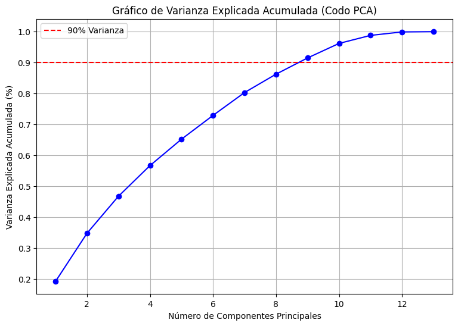

## CONTEXTO DEL PROBLEMA DESCRITO

- Realizando un análisis más exhaustivo, teníamos la idea que crear un algoritmo de clasificación relacionado con la enfermedad de la tuberculosis. Sin embargo, NO hemos encontrado un database con la cantidad de datos suficientes para poder trabajar con el tema.
- Esto nos ha hecho pensar en realizar un algoritmo que tenga beneficios para las empresas que trabajan con maquinarias de alto rendimiento y que tienen un alto coste. 

## INTRODUCCIÓN PROYECTO

Bienvenidos al repositorio oficial de una aplicación que permitirá que empresas que elaboren un sin fin de productos  se vean beneficiadas con este algoritmo que permite predecir el funcionamiento y posible tiempo de averia de una maquinaria determinada, siempre y cuando esta funcione a través de diversos sensores. Este proyecto forma parte del aprendizaje del curso Python + Inteligencia Artificial, combinando conceptos de programación estructurada, Numpy, Pandas, bases de datos, APIs y arquitectura web moderna.
 
## OBJETIVOS DEL PROYECTO

Los objetivos principales del proyecto:

1.- Realizar un algoritmo que permita estimar a través de funciones matemáticas (Numpy), el correcto funcionamiento de maquinarias que trabajen con sensores. 
2.- Utilizar gráficos que muesten y estimen correctamente los valores de/los dataset utilizados para entrenar el algoritmo.

## ANALISIS DE LA BASE DE DATOS A UTILIZAR

- Se utilizará una base de datos obtenida desde kaggle:
https://www.kaggle.com/datasets/iuryck/datasetsone-year-compiledcsv

- Esta base de datos posee más de 1000000 de filas y 14 columnas.

- Una de los analisis más importantes son las columnas, estas es la explicación de cada una:

1.-  **timestamp**	(Marca de tiempo) -> Representa el instante temporal preciso, con resolución de milisegundos, en el que el PLC (Controlador Lógico Programable) o el sistema de adquisición de datos capturó el estado de todos los sensores. Es la variable de referencia para el análisis de series temporales. 
@ Clasificación de variable: datetime, temporal.
@ Valores mínimo y máximo: 0 / 8.2

2.-  **pCut::Motor_Torque** (Par (torque) del motor en la estación o proceso “pCut”) -> Esta columna es el complemento perfecto para el Lag_error. Si el Lag_error nos dice cuánto se está retrasando la máquina, el Motor_Torque nos dice cuánta fuerza está teniendo que hacer para intentar cumplir con su tarea.
Registra el par de torsión (fuerza de giro) generado por el motor en la estación de corte (pCut). En un sistema de lazo cerrado, el controlador aumenta el torque cuando detecta una resistencia física para mantener la velocidad o posición programada. Se mide habitualmente en Newton-metro (Nm) o como un porcentaje del torque nominal del motor.
@ Clasificación de variable: numérica continua, float, Carga/esfuerzo.
@ Valores mínimo y máximo: -6.56 / 3.86 

3.-  **pCut::CTRL_Position_controller::Lag_error**	(Error de seguimiento (lag error) en el controlador de posición de “pCut”). -> Representa el error de seguimiento del controlador de posición en la estación de corte (pCut). Es la diferencia instantánea entre la posición teórica dictada por el perfil de movimiento (consigna) y la posición real medida por el encoder del motor. En un sistema ideal, este valor debería ser cercano a cero.
@ Clasificación de variable: numérica continua, float, Precisión.
@ Valores mínimo y máximo: -1.89 / 2.02

4.-  **pCut::CTRL_Position_controller::Actual_position** -> Con esta columna cerramos el triángulo fundamental del control de movimiento: Lo que pides (Setpoint), lo que haces (Actual Position) y la diferencia (Lag Error).
Es la lectura en tiempo real del sensor de posición (normalmente un encoder rotativo o lineal) en la estación de corte. Indica el lugar físico exacto donde se encuentra la herramienta o el material en un instante "t". A diferencia de la "posición de consigna" (que es lo que la máquina cree que debería hacer), esta es la verdad física del proceso.
@ Clasificación de variable: numérica continua, float.
@ Valores mínimo y máximo: -2039056494 / 1.91b

5.-  **pCut::CTRL_Position_controller::Actual_speed** -> (Esta columna es el "ritmo cardíaco" de la estación de corte. Mientras que la posición nos dice dónde está, la velocidad nos dice cómo de estable es el movimiento.)
Descripción ampliada:
Indica la velocidad instantánea real a la que se desplaza el eje en la estación pCut. Se obtiene generalmente calculando la tasa de cambio de la posición en el tiempo (derivada de la posición). En un entorno industrial, se suele expresar en milímetros por segundo (mm/s) o revoluciones por minuto (RPM).
@ Clasificación de variable: numérica continua, float.
@ Valores mínimo y máximo: -9,48k / 17,9k

6.-  **pSvolFilm::CTRL_Position_controller::Actual_position**	(Posición real actual en el sistema o estación “pSvolFilm”) -> Pasamos de la estación de corte (pCut) a pSvolFilm. Por el nombre, esto suena a un sistema de desbobinado o alimentación de film (lámina de plástico o papel). Aquí la dinámica cambia: ya no es un golpe seco como el corte, sino un movimiento continuo y fluido.
Registra la ubicación física exacta del eje encargado del manejo del film en la estación pSvolFilm. Mientras que en el corte la posición suele ser un recorrido de ida y vuelta, en un sistema de film, esta variable suele indicar la cantidad de material que ha pasado o la posición de un rodillo compensador (dancer arm) que mantiene la tensión.
@ Clasificación de variable: numérica continua, float.
@ Valores mínimo y máximo: 194k / 1.45b

7.-  **pSvolFilm::CTRL_Position_controller::Actual_speed**	Velocidad real actual en el sistema “pSvolFilm” -> Al tratarse de la estación pSvolFilm, esta velocidad es el factor determinante para que el material no se rompa ni se amontone.
Representa la velocidad lineal o rotacional real del eje de alimentación de film. A diferencia de un eje de corte que acelera y frena bruscamente, la velocidad en pSvolFilm suele buscar un estado estacionario (constante) para garantizar que el material fluya sin tirones. Es la métrica que nos dice qué tan rápido se está desenrollando o transportando la lámina.
@ Clasificación de variable: numérica continua, float.
@ Valores mínimo y máximo: -20.1 - 18k 

8.-  **pSvolFilm::CTRL_Position_controller::Lag_error** -> En un controlador de posición (position controller), el Lag_error es la diferencia matemática entre la posición que el algoritmo le ordena a la máquina tener y la posición real que los sensores reportan en un momento exacto "t" (tiempo continuo).
Ahora bien, es importante conocer: 

Si estás buscando predecir el "buen o mal funcionamiento", el comportamiento de esta columna te da pistas directas sobre la salud mecánica:

Desgaste Mecánico: Si el error de lag aumenta gradualmente con los días, es muy probable que haya fricción excesiva, falta de lubricación o desgaste en las guías.

Holguras (Backlash): Si el error salta bruscamente cuando la máquina cambia de dirección, tienes un problema de juego mecánico.

Sobrecarga: Un pico repentino en el Lag_error suele indicar que la maquinaria encontró una resistencia física que no pudo superar a la velocidad prevista (un atasco o una pieza mal colocada).

Sintonización del Control (PID): Si el error oscila mucho, el controlador no está bien ajustado para la carga actual.

Con respecto a "t": Es crucial tener el tiempo en este punto, ya que:

En tu base de datos, el error de lag no se analiza de forma aislada, sino en función de cómo evoluciona:
"t_0" (Estado ideal): La máquina recibe la orden de moverse y el motor responde casi al instante. El error es cercano a cero.
"t_{n}" (El retraso): Debido a la inercia, el rozamiento o el peso de la pieza, la parte mecánica siempre va un "pelín" por detrás de la orden eléctrica. Ese "retraso" es el que se mide en cada instante.
@ Clasificación de variable: numérica continua, float.
@ Valores mínimo y máximo: -0.91 / 3.57

9.-  **pSpintor::VAX_speed** -> El nombre pSpintor suena a una estación de giro o torsión (posiblemente un cabezal giratorio o un eje principal de tracción). Y el prefijo VAX suele referirse a un Eje Virtual (Virtual Axis) o a un valor de referencia de alta precisión.
Indica la velocidad del eje virtual (o eje maestro de referencia) en la estación de giro pSpintor. A diferencia de las velocidades "Actual", la VAX_speed suele representar la velocidad teórica ideal que el sistema intenta alcanzar para que el resto de los ejes (como el corte y el film) se sincronicen con ella. Es el "metrónomo" que marca el ritmo de toda la maquinaria.
@ Clasificación de variable: numérica continua, float.
@ Valores mínimo y máximo: 0 / 3,6k

10.- **month** -> Valores mínimo y máximo: 1 al 12

11.- **day** -> Valores mínimo y máximo: 1 al 31

12.- **hour** -> Valores mínimo y máximo: 00 a 23

### ESTAS 3 COLUMNAS, 10, 11 Y 12, REPRESENTAN LA DESCOMPOSICIÓN DE LA MARCA DEL TIEMPO  ORIGINAL EN UNIDADES DISCRETAS.
@ Clasificación de variable: numericas discretas int, temporal. 

13.- **sample_Number** -> Es un contador secuencial y único asignado a cada fila de datos. A diferencia del timestamp, que mide el tiempo real, el sample_Number mide el orden de captura. En sistemas de alta velocidad, es el identificador que asegura que no se ha perdido ningún paquete de información entre el sensor y la base de datos.
@ Clasificación de variable: numerica discreta, int64. 
@ Valores mínimo y máximo: 0 / 518

14.- **mode** -> En sistemas industriales, cada número suele corresponder a una fase específica del ciclo de trabajo o a una configuración de producto distinta.
Variable categórica que define el estado operativo de la máquina. Estos 6 modos actúan como el "contexto" de todos los demás sensores. Lo que en el Mode2 puede ser una velocidad normal, en el Mode5 podría ser una anomalía crítica.

(Hipótesis común en este tipo de máquinas):

Modo 1-2: Inicio / Referenciado (Homing) -> Búsqueda de cero, limpieza o enhebrado del film (pSvolFilm). Aquí el torque es bajo y las velocidades son lentas.

Modo 3-4: Producción Manual o Lenta (Ajustes).* diversas velocidades

Modo 5-6: Producción Automática (Alta velocidad).*

* En estos modos el Lag_error es más sensible.

Modo 7: Parada de Emergencia / Recuperación. Estados de pausa, error o recuperación tras una parada de emergencia.

Modo 8: Mantenimiento / Diagnóstico.
@ Clasificación de variable: Categórica ordinal, int (contexto).
@ Valores mínimo y máximo: mode1 / mode8 

## PREGUNTAS

1. ¿En qué modo de operación la máquina "sufre" más?
La respuesta técnica: Usando la columna pCut::Motor_Torque.

Análisis: Comparas el promedio de torque en el Modo 1 frente al Modo 8. Esta es una buena opción para realizar una gráfica, hay que incluir hue= mode

@ Ahora bien, la utilidad que va a tener este dato o respuesta frente a las empresas es poder señalar que por ejemplo, en el modo 5 o 6, el motor trabaja al 90% de su capacidad, sugiriendo que en ese modo la vida útil de los engranajes se ven reducidos. 

2. ¿Existe una "fatiga invisible" en la estación de corte (pCut)?
- La fatiga invisible, corresponde al deterioro que no provoca una parada inmediata en la maquinaria, pero que está consumiendo su vida útil. Muchas veces este deterioro es más bajo al que los sensores pueden detectar.

Respuesta técnica: Relacionando Actual_speed con Lag_error. Estos son los datos que están más vinculados y con los que se podría realizar un analisis de regresión. 

- A veces, a la misma velocidad, el error de posición es mayor hoy que hace una semana. Eso se llama drift (deriva).

@ Una respuesta al analisis de estos datos para la empresa, como ejemplo se podría señalar que manteniendo la velocidad constante, el error de precisión aumenta un 5% cada 100 horas. Esto es una señal clara de que falta lubricación o hay desgaste en el rodamiento".

3. ¿Están sincronizadas la alimentación de film (pSvolFilm) y el corte (pCut)?
La respuesta técnica: Correlación entre las dos Actual_speed.

- Si la velocidad del film varía bruscamente justo antes de que el Lag_error del corte suba, el problema no es la cuchilla, es el tirón que da el film.

Una respuesta al analisis de estos datos para la empresa, Muchos de los errores de corte (80%)son causados por una desincronización en la tensión del film, no por un fallo del motor de corte.
Respuesta:

matriz_correlacion = np.corrcoef(df1_copia['pCut::CTRL_Position_controller::Actual_speed'], df1_copia['pSvolFilm::CTRL_Position_controller::Actual_speed'])
matriz_correlacion[0, 1]

- Mostrar:
print(f"La sincronización entre film y corte es de: {matriz_correlacion[0, 1]}")

**La sincronización entre film y corte es de: -0.3410932175678699**

+ Tras realizar el análisis mediante el Coeficiente de Correlación de Pearson, se ha obtenido un valor de -0.34. Este resultado indica una correlación negativa débil, lo que evidencia que los sensores no están sincronizados: mientras uno aumenta su valor, el otro tiende a disminuirlo, pero sin un patrón coherente.

Conclusión técnica: La falta de sincronía (lejos del valor óptimo de 1 o -1) sugiere que no se pueden tratar como variables dependientes. Por tanto, para un análisis robusto de averías, es necesario trabajar con ambos sensores de forma separada o investigar un posible desfase mecánico/electrónico en la captura de datos.

https://cursos.kobalto.es/teoria/seaborn-criterio-experto

## SIGUIENTES PASOS

Para el desarrollo del modelo predictivo (machine learning), se han diseñado cinco variables sintéticas que transforman los datos brutos de los sensores en indicadores de salud mecánica:

**1.-** Averia_Motor: Variable binaria (0/1). Se activa cuando el error de seguimiento del motor de corte (pCut::Lag_error) supera el umbral crítico de 1 (aunque se recomienda 0.5). Representa una pérdida de precisión inmediata en la estación de corte.

umbral_averia_motor = 1

df1_copia['Averia_Motor'] = (df1_copia['pCut::CTRL_Position_controller::Lag_error'].abs() >= umbral_averia_motor).astype(int)

**2.-** Averia_Film: Variable binaria (0/1). Indica una anomalía en la estación de alimentación de film cuando el pSvolFilm::Lag_error supera 2 (aunque se recomienda 0.5), señalando posibles tirones o falta de tensión en el material.

umbral_averia_film = 2

df1_copia['Averia_Film'] = (df1_copia['pSvolFilm::CTRL_Position_controller::Lag_error'].abs() >= umbral_averia_film).astype(int)

3.- Sincronia (desfase): Calcula la diferencia entre la velocidad de referencia ideal (VAX_speed) y la velocidad real de la maquinaria. Es vital para identificar desajustes en el "ritmo" del proceso que causan el 80% de los fallos.

df1_copia['desfase'] = df1_copia['pSpintor::VAX_speed'] - df1_copia['pSvolFilm::CTRL_Position_controller::Actual_speed']

4.- Esfuerzo_Relativo: Relación matemática entre el par del motor (Motor_Torque) y el error cometido (Lag_error). Mide la eficiencia: cuánta fuerza extra debe aplicar el sistema para corregir una desviación de posición.

df1_copia['esfuerzo_relativo'] = df1_copia['pCut::Motor_Torque'] / (df1_copia['pCut::CTRL_Position_controller::Lag_error'] + 1e-5)

5.- Fatiga: Basada en una media móvil (Rolling Mean) de los errores acumulados. Identifica el Drift o degradación progresiva, permitiendo detectar el desgaste antes de que ocurra una parada de emergencia.
Al utilizar una media móvil del error de seguimiento, logramos identificar la 'fatiga invisible' o drift mecánico (La deriva, El drift es cuando el error va subiendo muy despacio), permitiendo al algoritmo predecir un fallo antes de que los sensores alcancen niveles críticos de alarma.
(https://cursos.kobalto.es/teoria/pandas-datetime#method=rolling)

df1_copia['Fatiga_Motor'] = df1_copia['pCut::CTRL_Position_controller::Lag_error'].abs().rolling(window=100).mean()

Ahora, se añadirá el siguiente código para corregir los NaN iniciales en los valores fatiga:
https://cursos.kobalto.es/teoria/pandas-missing#method=fillna

df1_copia.fillna(0, inplace=True)  

Cambia los NaN del principio por 0, ya que los primeros valores no tienen los suficiente valores para el promedio. 

## COLUMNAS FINALES:

**1.-** Averia_Motor: Variable binaria (0/1). Se activa cuando el error de seguimiento del motor de corte (pCut::Lag_error) supera el umbral crítico de 1 (aunque se recomienda 0.5). Representa una pérdida de precisión inmediata en la estación de corte.

umbral_averia_motor = 1

df1_copia['Averia_Motor'] = (df1_copia['pCut::CTRL_Position_controller::Lag_error'].abs() >= umbral_averia_motor).astype(int)

**2.-** Averia_Film: Variable binaria (0/1). Indica una anomalía en la estación de alimentación de film cuando el pSvolFilm::Lag_error supera 2 (aunque se recomienda 0.5), señalando posibles tirones o falta de tensión en el material.

umbral_averia_film = 2

df1_copia['Averia_Film'] = (df1_copia['pSvolFilm::CTRL_Position_controller::Lag_error'].abs() >= umbral_averia_film).astype(int)

3.- Relación averías, la Avería Total es 1 si cualquiera de las dos averías específicas ocurre.

df1_copia['Averia_Total'] = ((df1_copia['Averia_Motor'] == 1) | (df1_copia['Averia_Film'] == 1)).astype(int)

## GRÁFICAS

Se han realizado las siguientes gráficas de barplot con gráficas sintéticas (s1, s2 y avería), con el objetivo de conocer error/ No error:

1.- Avería sensor 1 y 2
2.- No avería sensores
3.- Avería sensor 1 y no sensor 2
4.- No avería sensor 1 y avería sensor 2.

## PREPROCESAMIENTO

- Se ha realizado el preprocesamiento de los datos, convirtiendo a través de un OrdinalEncoder la columna Mode.
- A través de un StandarScaler, se han "estandarizado las columnas", sin incluir las columnas sintéticas, obteniendo el X_scaler para posteriores análisis. Se ha optado por la estandarización mediante StandardScaler en lugar de una normalización de rango fijo (0-1). Esto permite que el modelo de Machine Learning interprete mejor las desviaciones del motor, manteniendo la integridad de los valores extremos (outliers) que son, precisamente, los que definen nuestras situaciones de avería S1 y S2."

## PCA

**Búsqueda de la inercia**

- Mediante el siguiente código hemos obtenido la inercia:

inertia = []  # Guardaremos la inercia para diferentes valores de k (número de clústeres)
for k in range(1, 11):  # Probar para k = 1 hasta k = 10
    kmeans = KMeans(n_clusters=k, random_state=42)
    kmeans.fit(X_scaled)
    inertia.append(kmeans.inertia_)

# Graficar la inercia para cada k (Método del Codo)
plt.figure(figsize=(8, 6))
plt.plot(range(1, 11), inertia, marker='o')
plt.title('Método del Codo para elegir el número de clústeres')
plt.xlabel('Número de clústeres (k)')
plt.ylabel('Inercia')
plt.show()

**Búsqueda del codo**

- Ahora si esta es la gráfica para encontrar el codo:

# 1. Configuramos el PCA (sin límite de componentes para verlos todos)
pca = PCA()
pca.fit(X_scaled)  

# 2. Calculamos la varianza acumulada. cumsum= Suma acumulativa. Cada elemento es la suma de todos los anteriores.
varianza_acumulada = np.cumsum(pca.explained_variance_ratio_)

# 3. Graficamos el codo (DEBE SER ASCENDENTE)
plt.figure(figsize=(9, 6))
plt.plot(range(1, len(varianza_acumulada) + 1), varianza_acumulada, marker='o', linestyle='-', color='b')
plt.axhline(y=0.90, color='r', linestyle='--', label='90% Varianza') # Referencia del 90%
plt.title('Gráfico de Varianza Explicada Acumulada (Codo PCA)')
plt.xlabel('Número de Componentes Principales')
plt.ylabel('Varianza Explicada Acumulada (%)')
plt.legend(loc='best')
plt.grid(True)
plt.show()

